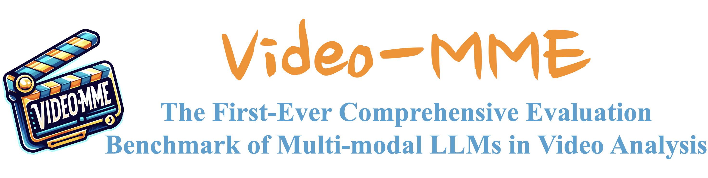
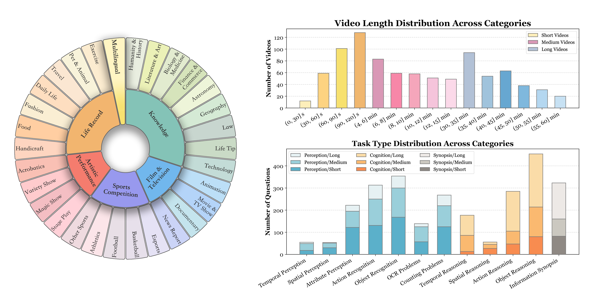
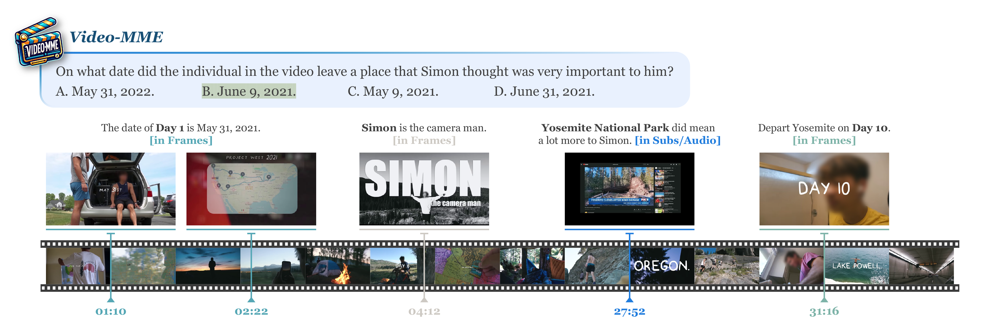
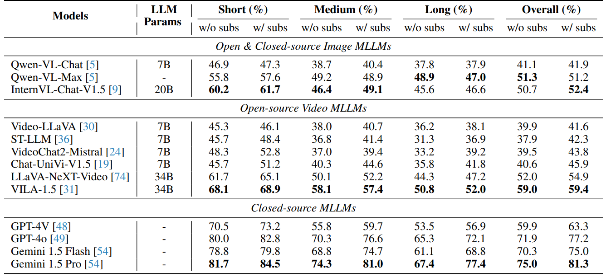
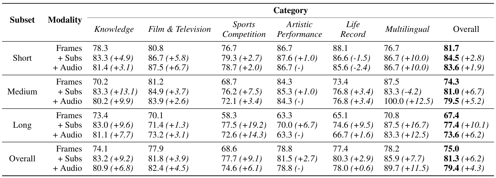

# Video-MME: The First-Ever Comprehensive Evaluation Benchmark of Multi-modal LLMs in Video Analysis

 
 
  
 
 


<p align="center">
    
</p>

<font size=7><div align='center' > [[🍎 Project Page](https://video-mme.github.io/)] [[📖 arXiv Paper](https://arxiv.org/pdf/2405.21075)] [[📊 Dataset](https://github.com/BradyFU/Video-MME?tab=readme-ov-file#-dataset-content)][[🏆 Leaderboard](https://video-mme.github.io/home_page.html#leaderboard)]  </div></font>

Video-MME applies to both **image MLLMs**, i.e., generalizing to multiple images, and **video MLLMs**. 🌟

If you want to add your model in our leaderboard, please feel free to email bradyfu24@gmail.com. We will update the leaderboard in time. ✨

If you have any question about the dataset, please feel free to email videomme2024@gmail.com. ✨

---

## 🔥 News
* **`2024.06.01`** 🌟 We are very proud to launch VideoMME, the first-ever comprehensive evaluation benchmark of MLLMs in Video Analysis!


## 👀 Video-MME Overview

In the quest for artificial general intelligence, Multi-modal Large Language Models (MLLMs) have emerged as a focal point in recent advancements, but their potential in processing sequential visual data is still insufficiently explored. We introduce <strong>Video-MME</strong>, the first-ever full-spectrum, <strong>M</strong>ulti-<strong>M</strong>odal <strong>E</strong>valuation benchmark of MLLMs in <strong>Video</strong> analysis. It is designed to comprehensively assess the capabilities of MLLMs in processing video data, covering a wide range of visual domains, temporal durations, and data modalities. Video-MME comprises **900 videos** with a total of 256 hours, and **2,700 human-annotated question-answer pairs**. Our work distinguishes from existing benchmarks through four key features: 
* *Diversity in video types*, spanning **6 primary visual domains**, i.e., Knowledge, Film & Television, Sports Competition, Life Record, and Multilingual, with **30 subfields** to ensure broad scenario generalizability;
* *Duration in temporal dimension*, encompassing both **short- (< 2min)**, **medium- (4min\~15min)**, and **long-term (30min\~60min)** videos, ranging from **11 seconds to 1 hour**, for robust contextual dynamics;
* *Breadth in data modalities*, integrating multi-modal inputs besides video frames, including **subtitles and audios**, to assess the all-round capabilities of MLLMs;
* *Quality in annotations*. **All data are newly collected and annotated by humans, not from any existing video dataset**, ensuring diversity and quality. 


<p align="center">
    
</p>

## 📐 Dataset Examples

<p align="center">
    
</p>

<div align='center' >
<details>
<summary> Click to expand more examples</summary>
<p align="center">
    
    
    
</details>
</div>


## 🔍 Dataset Content
**License**:
```
Video-MME is only used for academic research. Commercial use in any form is prohibited.
The copyright of all videos belongs to the video owners.
If there is any infringement in Video-MME, please email videomme2024@gmail.com and we will remove it immediately.
Without prior approval, you cannot distribute, publish, copy, disseminate, or modify Video-MME in whole or in part. 
Video-MME can only be used if you agree the above restrictions.
```
In the case that you strictly comply with the above license, you can find the content of Video-MME on [Google Drive](https://drive.google.com/file/d/1AHZQpuku14ETgxFiOpfe2OZ_5UN9-Q58/view?usp=drive_link). Otherwise, it is not allowed to click or use.

If you have any question, please feel free to email **videomme2024@gmail.com**.

The content is structured in a JSON format, with each instance containing the following fields:

```bash
{
  "video_id": "",  # The id of the video
  "duration_category": "",  # short, medium, long
  "video_category": "",  # The category of video
  "video_sub_category": "",  # The sub-category of video
  "url": "",  # The url of the video
  "questions": [
    {
      "question_id": "",  # The id of the question
      "task_type": "",  # The category of the question
      "question": "",  # The question
      "choices": ["", "", "", ""],  # The choices of the question
      "answer": ""  # The answer of the question
    },
    {
      "question_id": "",  # The id of the question
      "task_type": "",  # The category of the question
      "question": "",  # The question
      "choices": ["", "", "", ""],  # The choices of the question
      "answer": ""  # The answer of the question
    },
    {
      "question_id": "",  # The id of the question
      "task_type": "",  # The category of the question
      "question": "",  # The question
      "choices": ["", "", "", ""],  # The choices of the question
      "answer": ""  # The answer of the question
    },
  ]
}
```

## 🔮 Evaluation Pipeline
**Prompt**:

The common prompt used in our evaluation follows this format:

```
This video's subtitles are listed below:
[Subtitles] 
Select the best answer to the following multiple-choice question based on the video. Respond with only the letter (A, B, C, or D) of the correct option. 
[Question]
The best answer is:
```

For the subtitles-free setting, you should remove the subtitle content.


<details>
<summary> Click to expand the prompt examples.</summary>

* With subtitles:

```
This video's subtitles are listed below:
Hi guys, I'm going to show you how to perfectly prepare a ...
Select the best answer to the following multiple-choice question based on the video. Respond with only the letter (A, B, C, or D) of the correct option.
What is the color of the clothing worn by the persons in the video?
A. Black.
B. Gray.
C. Green.
D. Brown.
The best answer is:
```

* Without subtitles:
```
Select the best answer to the following multiple-choice question based on the video. Respond with only the letter (A, B, C, or D) of the correct option.
What is the color of the clothing worn by the persons in the video?
A. Black.
B. Gray.
C. Green.
D. Brown.
The best answer is:
```
</details>


**Evaluation**: 

To extract the answer and calculate the scores, we add the model response to the provided JSON file. Here we provide an example template [output_test_template.json](./evaluation/output_test_template.json). Once you have prepared the model responses in this format, please execute our evaluation script [eval_your_results.py](./evaluation/eval_your_results.py), and you will get the accuracy scores across video_durations, video domains, video subcategories, and task types. 
The evaluation does not introduce any third-party models, such as ChatGPT.

```bash
python eval_your_results.py --results_file $YOUR_RESULTS_FILE --video_duration_type $VIDEO_DURATION_TYPE 
```
Please ensure that the `results_file` follows the specified JSON format stated above, and `video_duration_type` is specified as either `short`, `medium`, or `long`. If you wish to assess results across various duration types, you can specify multiple types separated by commas or organize them in a list, for example: `short,medium,long` or `["short","medium","long"]`.


## 📈 Experimental Results
- **Evaluation results of different MLLMs.**

<p align="center">
    
</p>


- **Evaluation results of different MLLMs across different task types.**

<p align="center">
    
</p>

- **Evaluation results of Gemini 1.5 Pro across different video duration types.**

<p align="center">
    
</p>

- **Evaluation results of Gemini 1.5 Pro across different video sub-types.**

<p align="center">
    
</p>


## :black_nib: Citation

If you find our work helpful for your research, please consider citing our work.   

```bibtex
@article{fu2024videomme,
  title={Video-MME: The First-Ever Comprehensive Evaluation of Multi-modal LLMs in Video Analysis},
  author={Fu, Chaoyou and Dai, Yuhan and Luo, Yongdong and Li, Lei and Ren, Shuhuai and Zhang, Renrui and Wang, Zihan and Zhou, Chenyu and Shen, Yunhang and Zhang, Mengdan and Chen, Peixian and Li, Yanwei and Lin, Shaohui and Zhao, Sirui and Li, Ke and Xu, Tong and Zheng, Xiawu and Chen, Enhong and Ji, Rongrong and Sun, Xing},
  journal={arXiv preprint},
  year={2024}
}
```

## 📜 Related Works

Explore our related researches:
-  **[MME]** [MME: A Comprehensive Evaluation Benchmark for Multimodal Large Language Models](https://github.com/BradyFU/Awesome-Multimodal-Large-Language-Models/tree/Evaluation)
-  **[Awesome-MLLM]** [A Survey on Multimodal Large Language Models](https://github.com/BradyFU/Awesome-Multimodal-Large-Language-Models)

